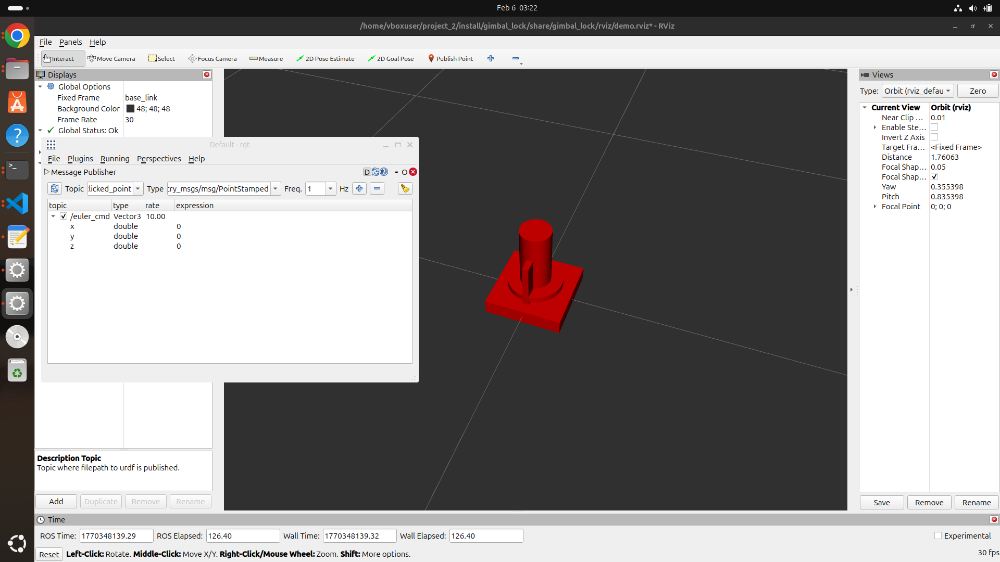
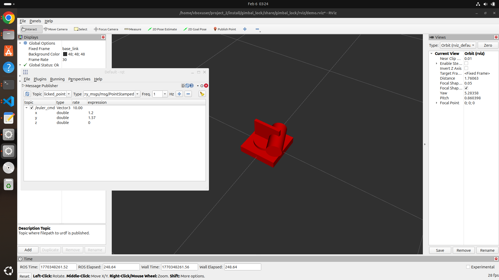

## project2_mmunoria

## How to run

## 1. Step 1 creating workspace

```bash
mkdir -p ~/project_2/
cd ~/project_2/
```

## 2.  Clone the repo from github

```bash
git clone https://github.com/mmunoria/project2_mmunoria.git
```

## 3. Build and source the package

```bash
colcon build --symlink-install
source install/setup.bash
```

## 4. Run the launch file (in terminal 1)

```bash
ros2 launch gimbal_lock gimbal.launch.py
```
- this should launch rviz

## 5. Start the Euler Joint Node (in terminal 2)

```bash
source install/setup.bash
ros2 run gimbal_lock euler_to_joint_node
```

## 6. Open rqt in terminal 3

```bash
rqt
```
- go to plugins -> Topics -> Message Publisher
- Select the *"/euler_cmd"*

## 7. For normal rotations

- set y (Pitch) to any value to 0, as shown below

- Change the values of x (Roll) and observe the motion

- Change th z (Yawn) and observe the motion

- for change in x the robot should rotate about the x axis
- for change in z the robot should rotate about the z axis

## 8. For Gimbal Lock 
- Change the y (Pitch) value to any value (+= 1.57)

- Change the values of z (Yaw) slowly and observe the robot motion

- Reset Yaw to 0
- Change Roll slowly

- At Pitch = + or - 1.57 (90 degrees) , Yaw and Roll appear to produce the same rotation (axes align)

